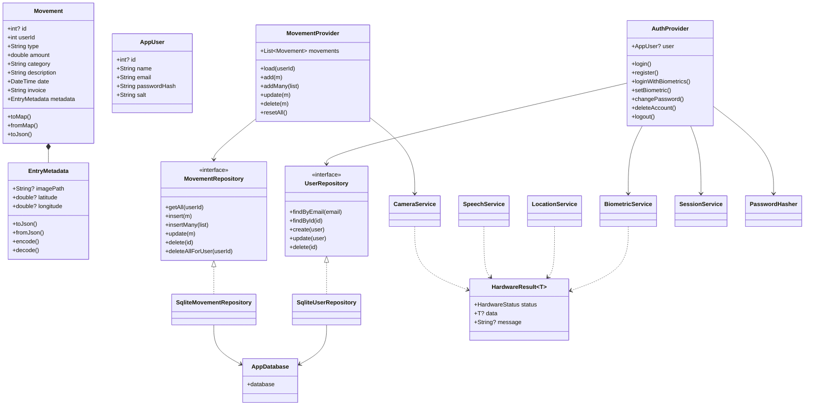
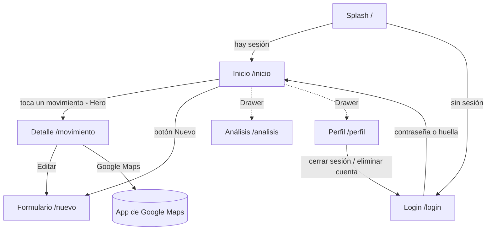
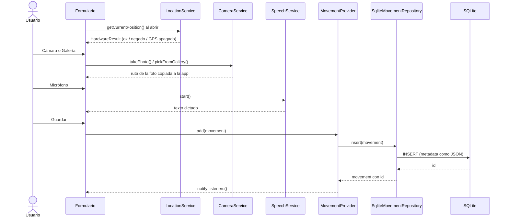

# Arquitectura de Finto (Flutter)

## Diagrama de clases

```mermaid
classDiagram
    class Movement {
      +int? id
      +int userId
      +String type
      +double amount
      +String category
      +String description
      +DateTime date
      +String invoice
      +EntryMetadata metadata
      +toMap()
      +fromMap()
      +toJson()
    }
    class EntryMetadata {
      +String? imagePath
      +double? latitude
      +double? longitude
      +toJson()
      +fromJson()
      +encode()
      +decode()
    }
    class AppUser {
      +int? id
      +String name
      +String email
      +String passwordHash
      +String salt
    }
    Movement *-- EntryMetadata

    class MovementRepository {
      <<interface>>
      +getAll(userId)
      +insert(m)
      +insertMany(list)
      +update(m)
      +delete(id)
      +deleteAllForUser(userId)
    }
    class UserRepository {
      <<interface>>
      +findByEmail(email)
      +findById(id)
      +create(user)
      +update(user)
      +delete(id)
    }
    class SqliteMovementRepository
    class SqliteUserRepository
    class AppDatabase {
      +database
    }
    MovementRepository <|.. SqliteMovementRepository
    UserRepository <|.. SqliteUserRepository
    SqliteMovementRepository --> AppDatabase
    SqliteUserRepository --> AppDatabase

    class CameraService
    class SpeechService
    class LocationService
    class BiometricService
    class SessionService
    class PasswordHasher
    class HardwareResult~T~ {
      +HardwareStatus status
      +T? data
      +String? message
    }

    class AuthProvider {
      +AppUser? user
      +login()
      +register()
      +loginWithBiometrics()
      +setBiometric()
      +changePassword()
      +deleteAccount()
      +logout()
    }
    class MovementProvider {
      +List~Movement~ movements
      +load(userId)
      +add(m)
      +addMany(list)
      +update(m)
      +delete(m)
      +resetAll()
    }
    AuthProvider --> UserRepository
    AuthProvider --> SessionService
    AuthProvider --> BiometricService
    AuthProvider --> PasswordHasher
    MovementProvider --> MovementRepository
    MovementProvider --> CameraService
    CameraService ..> HardwareResult
    SpeechService ..> HardwareResult
    LocationService ..> HardwareResult
    BiometricService ..> HardwareResult
```

## Flujo de navegación

```mermaid
flowchart TD
    S[Splash /] -->|hay sesión| H[Inicio /inicio]
    S -->|sin sesión| L[Login /login]
    L -->|contraseña o huella| H
    H -->|toca un movimiento - Hero| D[Detalle /movimiento]
    H -->|botón Nuevo| F[Formulario /nuevo]
    D -->|Editar| F
    D -->|Google Maps| GM[(App de Google Maps)]
    H -. Drawer .-> A[Análisis /analisis]
    H -. Drawer .-> P[Perfil /perfil]
    P -->|cerrar sesión / eliminar cuenta| L
```

## Flujo para guardar un movimiento

```mermaid
sequenceDiagram
    actor U as Usuario
    participant F as Formulario
    participant LS as LocationService
    participant CS as CameraService
    participant SS as SpeechService
    participant MP as MovementProvider
    participant R as SqliteMovementRepository
    participant DB as SQLite

    F->>LS: getCurrentPosition() al abrir
    LS-->>F: HardwareResult (ok / negado / GPS apagado)
    U->>F: Cámara o Galería
    F->>CS: takePhoto() / pickFromGallery()
    CS-->>F: ruta de la foto copiada a la app
    U->>F: Micrófono
    F->>SS: start()
    SS-->>F: texto dictado
    U->>F: Guardar
    F->>MP: add(movement)
    MP->>R: insert(movement)
    R->>DB: INSERT (metadata como JSON)
    DB-->>R: id
    R-->>MP: movement con id
    MP-->>F: notifyListeners()
```
